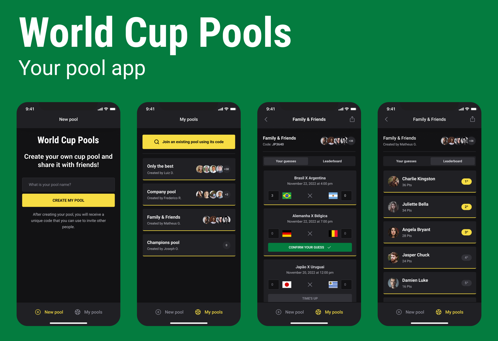

<h1 align="center">⚽️ World Cup Pools</h1>

<p align="center">
  
  
  
</p>

<p align="center">
  <a href="#dart-about">About</a> &#xa0; | &#xa0; 
  <a href="#sparkles-features">Features</a> &#xa0; | &#xa0;
  <a href="#checkered_flag-starting">Starting</a> &#xa0; | &#xa0;
  <a href="#rocket-technologies">Technologies</a> 
</p>

<br>

## :dart: About

This project in React Native is an app to make Polls from World Cup Soccer.

<br>

## :sparkles: Features

:heavy_check_mark: Create any Polls;\
:heavy_check_mark: Create Guesses per Poll;\
:heavy_check_mark: Show Ranking per Poll;\
:heavy_check_mark: Share Polls with friends;

<br>

## :checkered_flag: Starting

```bash

# Clone this project
$ git clone https://github.com/matheusguermandi/world-cup-pool.git

# --- SERVER ---

# Access
$ cd world-cup-pool/server

# Install dependencies
$ npm install

# Run the project with Expo
$ npm run dev


# --- MOBILE ---

# Access
$ cd world-cup-pool/mobile

# Install dependencies
$ npm install

# Run the project with Expo
$ npx expo start

# The expo server will initialize in the exp://localhost:19000
# You can scan the QR code above with Expo Go (Android) or
# the Camera app (iOS)
```

<br>

## :rocket: Technologies

The following tools were used in this project:

| Mobile                                           | Server                                                                |
| ------------------------------------------------ | --------------------------------------------------------------------- |
| [Expo](https://expo.io/)                         | [Node.js](https://nodejs.org/en/)                                     |
| [Axios](https://axios-http.com/)                 | [Fastify](https://www.fastify.io/docs/latest/Guides/Getting-Started/) |
| [Node.js](https://nodejs.org/en/)                | [Prisma](https://www.prisma.io/)                                      |
| [React](https://pt-br.reactjs.org/)              | [TypeScript](https://www.typescriptlang.org/)                         |
| [React Native](https://reactnative.dev/)         | [Zod](https://www.npmjs.com/package/zod)                              |
| [React Navigation](https://reactnavigation.org/) | [ShorUniqueID](https://www.npmjs.com/package/short-unique-id)         |
| [TypeScript](https://www.typescriptlang.org/)    | [Diagrama ERD](https://www.npmjs.com/package/prisma-erd-generator/)   |

<br>

## Entity Relationship Diagram

<p align="center">

</p>
